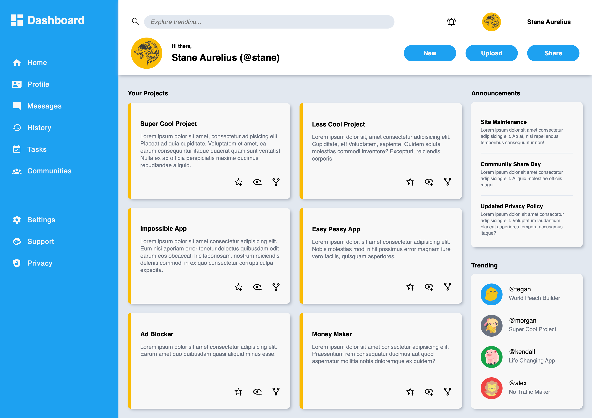
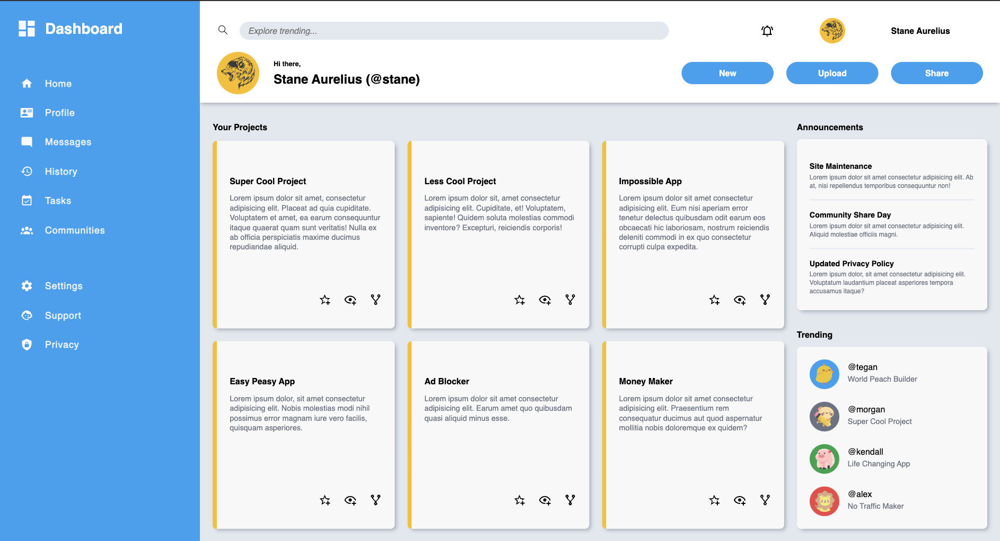
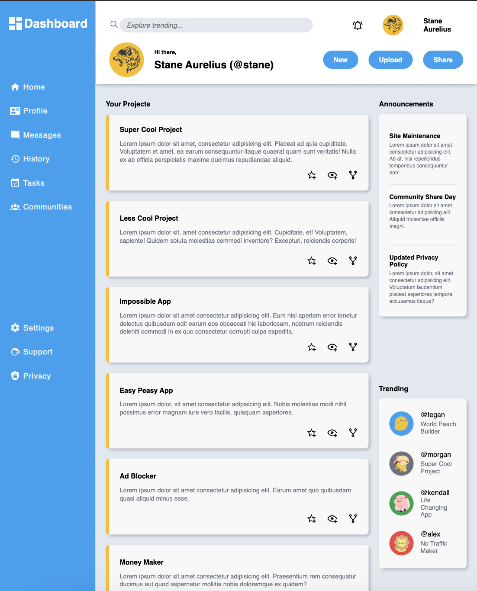

# Dashboard

This project is part of **The Odin Project's** Intermediate HTML and CSS course of the Full Stack JavaScript path. Completing this project demonstrates an understanding and proficiency in using HTML and CSS grid to structure and style an entire dashboard page for showcasing user projects. This project requires an understanding of:

- *HTML structure* for creating the content & structure of the web page,
- *CSS styling* for creating the dynamic layout using grid

## Project Result

The layout of the project cards shown in the main content section of the website is **dynamic**, meaning it can expand from 1 column (*on narrow screen*) to multiple columns (*on wide screen*)

### Normal Screen Preview

### Wide Screen Preview

### Narrow Screen Preview

## Attribution

- Every SVG icons used in this project was obtained from [Material Design Icons](https://pictogrammers.com/library/mdi/)
- The transparent wolf picture used in the header profile picture was obtained from [SeekPNG](https://www.seekpng.com/ima/u2y3q8u2w7e6r5y3/)
- The animal icons used as profile picture in the trending section were obtained from [Flaticon](https://www.flaticon.com/)