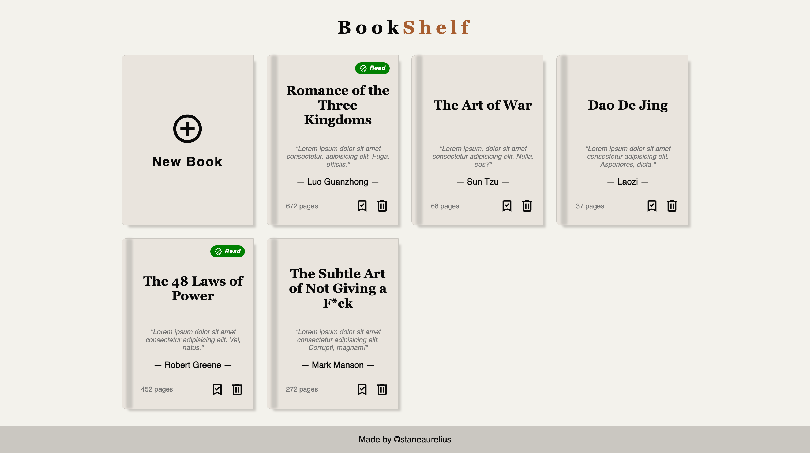
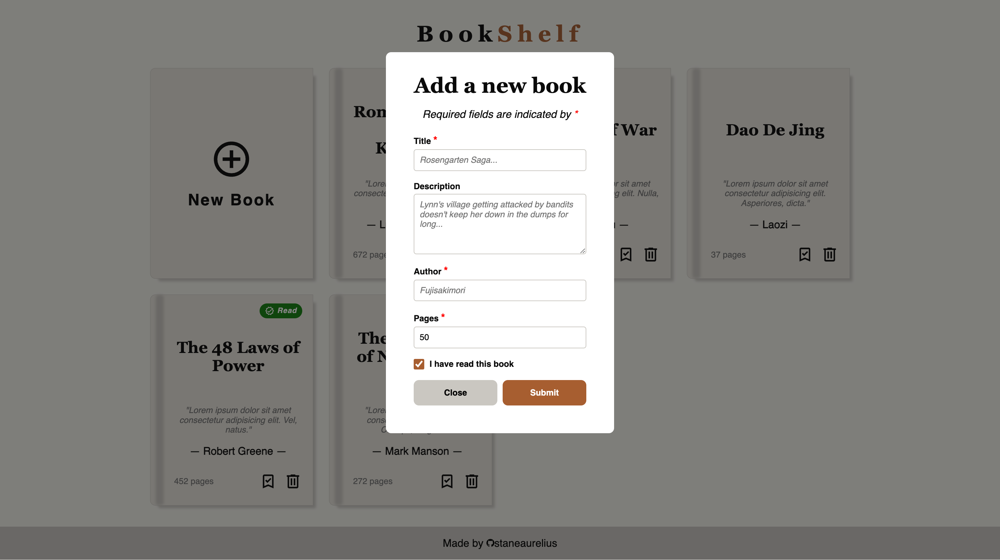

# Book Library

This project is part of **The Odin Project's** JavaScript course of the Full Stack JavaScript path. Completing this project demonstrates an understanding and proficiency in using HTML, CSS, and JavaScript to create a library which allows user to store a collection of books. This project requires an understanding of:

- *HTML structure* for creating the content & structure of the web page;
- *CSS styling* for creating the dynamic layout using grid and flexbox;
- *JavaScript* for providing user the functionalities of adding, removing, and marking books as read

## Project Result

The layout of the books shown in the library section of the website is **dynamic**, it can expand from having 3 books in a row (on a narrow screen) depending on the screen size.

### Library Preview

### Library Modal Preview

## Attribution

- Every SVG icons used in this project was obtained from [Material Design Icons](https://pictogrammers.com/library/mdi/)
- The book design and color palette was obtained from [TemplatesJungle](https://templatesjungle.gumroad.com/l/booksaw-free-bookstore-figma-web-template?a=184260307)