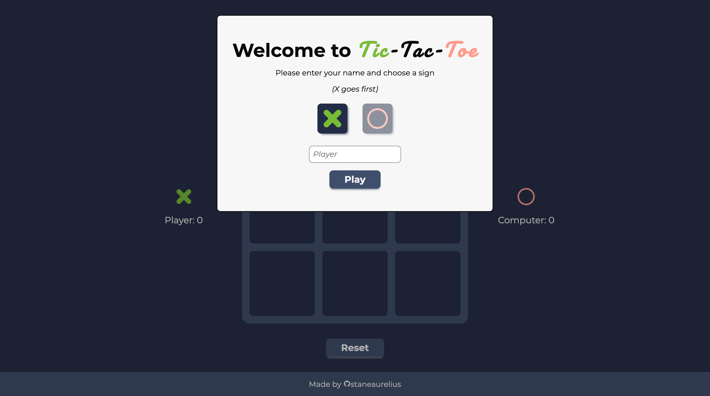
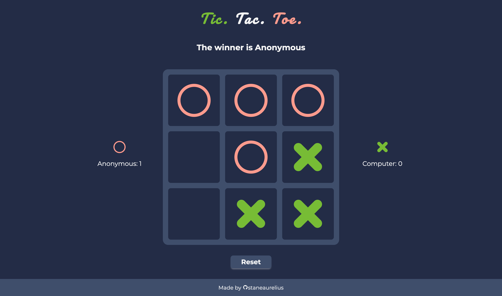

# Tic-Tac-Toe

This project is part of **The Odin Project's** JavaScript course of the Full Stack JavaScript path. Completing this project demonstrates an understanding and proficiency in using HTML, CSS, and JavaScript to create a [Tic-Tac-Toe](https://en.wikipedia.org/wiki/Tic-tac-toe) game web-page. This project requires an understanding of:

- *HTML structure* for creating the content & structure of the web page;
- *CSS styling* for creating the web layout using grid and flexbox;
- *JavaScript* for creating the game logic

## Project Result

### Player Input Preview

### Game Preview
