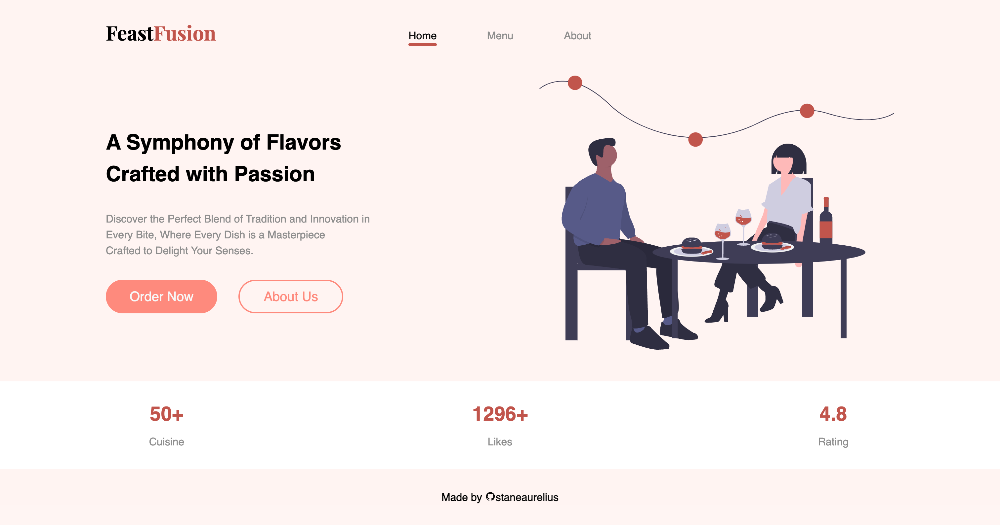
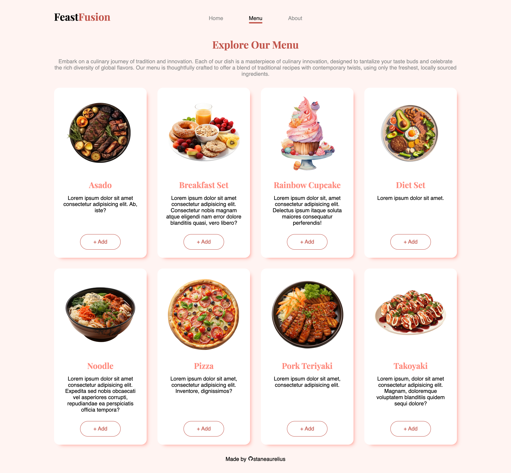
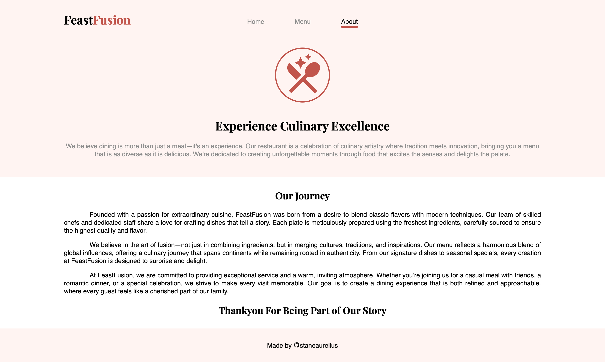

# Restaurant

This project is part of **The Odin Project's** JavaScript course of the Full Stack JavaScript path. Completing this project demonstrates an understanding and proficiency in using HTML, CSS, and JavaScript to create a *restaurant* website consisting of multiple pages, with each page generated from a JS module. This project requires an understanding of:

- *HTML structure* for creating the template of the web page;
- *CSS styling* for creating the web layout using grid and flexbox, as well as adding styling to the web pages;
- *JavaScript* for adding contents to the website template

## Project Result

### Home Page Preview

### Menu Page Preview

### About Page Preview

## Attribution

- The dining SVG present in the home page was created by [unDraw](https://undraw.co/illustrations)
- All png images present in the menu page was created by [Vecteezy](https://www.vecteezy.com/)