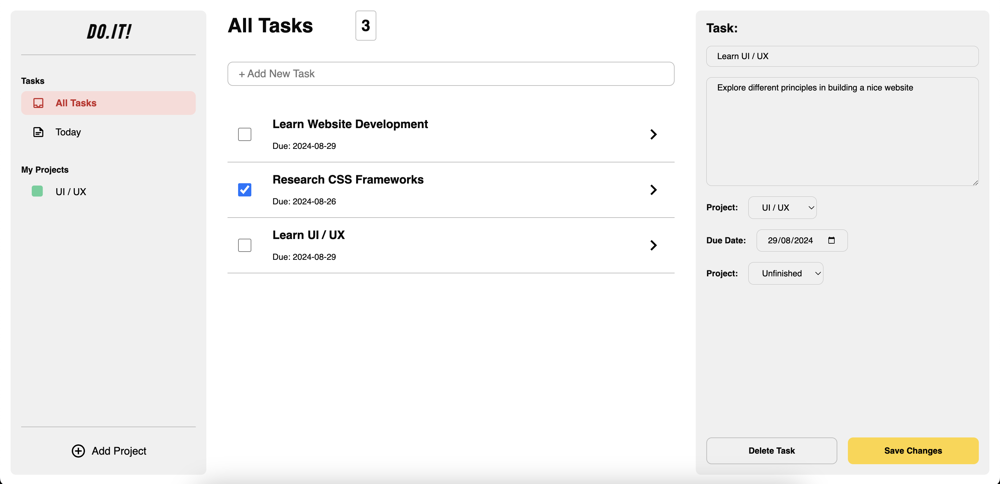

# To-Do List

This project is part of **The Odin Project's** JavaScript course of the Full Stack JavaScript path. Completing this project demonstrates an understanding and proficiency in using HTML, CSS, and JavaScript to create a *To-Do List* website which allows users to store, delete, and change to-do tasks and projects. This project requires an understanding of:

- *HTML structure* for creating the template of the web page;
- *CSS styling* for creating the web layout using grid and flexbox, as well as adding styling to the web pages;
- *JavaScript* for adding functionality to the web page

> *This project does not implement any data storing technique, hence the data input in this project will not persist*

## Project Result

