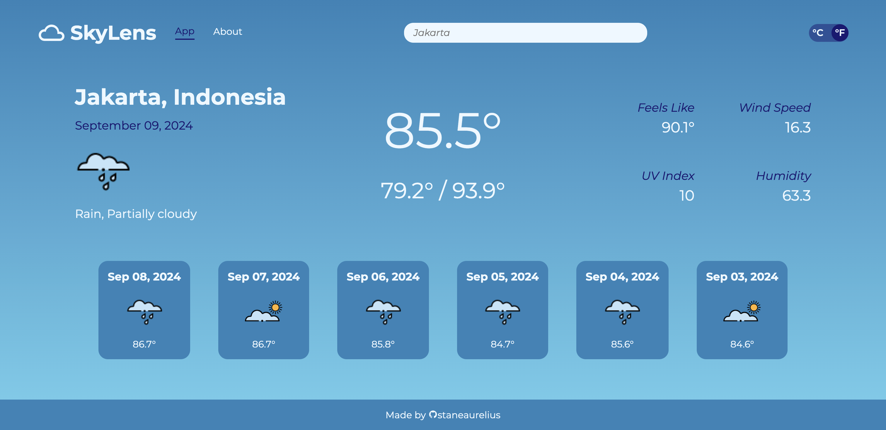
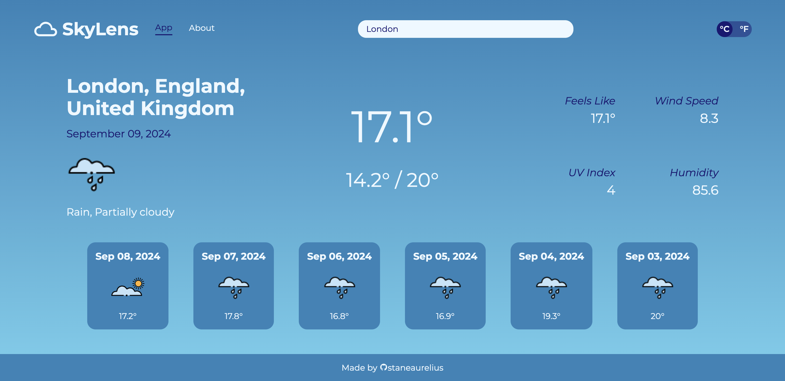

# Weather

This project is part of **The Odin Project's** JavaScript course of the Full Stack JavaScript path. Completing this project demonstrates an understanding and proficiency in using HTML, CSS, and JavaScript to create a *Weather* website which lets user input a location and obtain a detailed weather information regarding that location. This project requires an understanding of:

- *HTML structure* for creating the template of the web page;
- *CSS styling* for creating the web layout, as well as adding styling to the web pages;
- *JavaScript* for fetching data and adding functionality to the web page

> *This project requires [Visual Crossing](https://www.visualcrossing.com/) API Key provided to src/js/keyGen.js in order to work.*

## Project Result

---

## Attribution

- The weather data was fetched from [Visual Crossing](https://www.visualcrossing.com/)
- The weather icons was obtained from [Visual Crossing GitHub](https://github.com/visualcrossing/WeatherIcons)