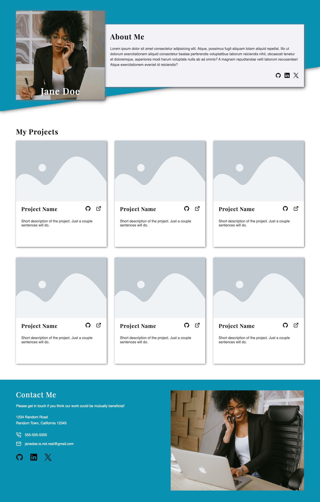
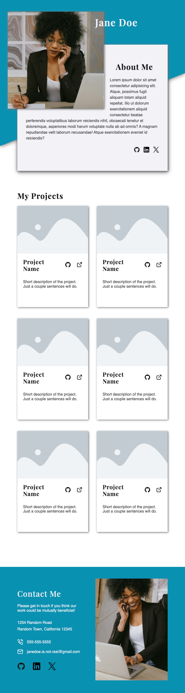

# Responsive Homepage

This project is part of **The Odin Project's** JavaScript course of the Full Stack JavaScript path. Completing this project demonstrates an understanding and proficiency in using HTML and CSS to create a *Responsive Homepage*. This project requires an understanding of:

- *HTML structure* for creating the template of the web page;
- *CSS styling* for creating the web layout using grid and flexbox, as well as adding styling to the web pages;
- *Media Queries* for restyling homepage based on the users' screen size

## Project Result

The homepage design changes based on the user's screen size with the following breakpoints:
- Desktop screen: width of 1024px and above
- Tablet screen: width of 768px and above
- Phone screen: width below 768px

### Desktop Version

### Tablet Version

### Phone Version

## Attribution

- GitHub, LinkedIn, and X (*formerly Twitter*) icons were obtained from [Devicon](https://devicon.dev/)
- Placeholder profile and contact pictures were created by [Anna Shvets](https://www.pexels.com/@shvetsa/) in Pexels
- Phone, mail, and external link icons were designed by [Feather](https://feathericons.com/)